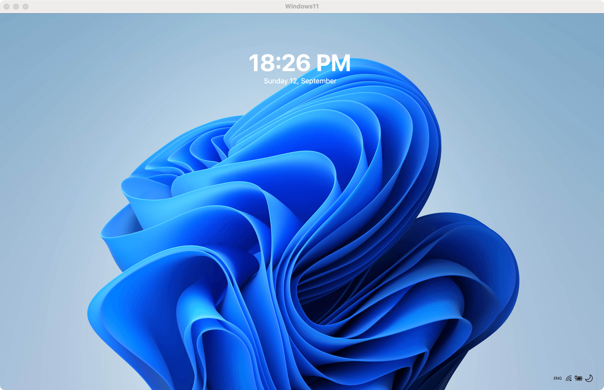
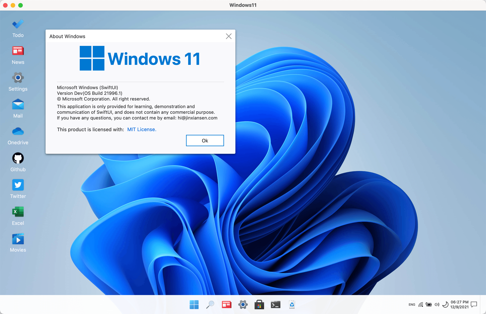
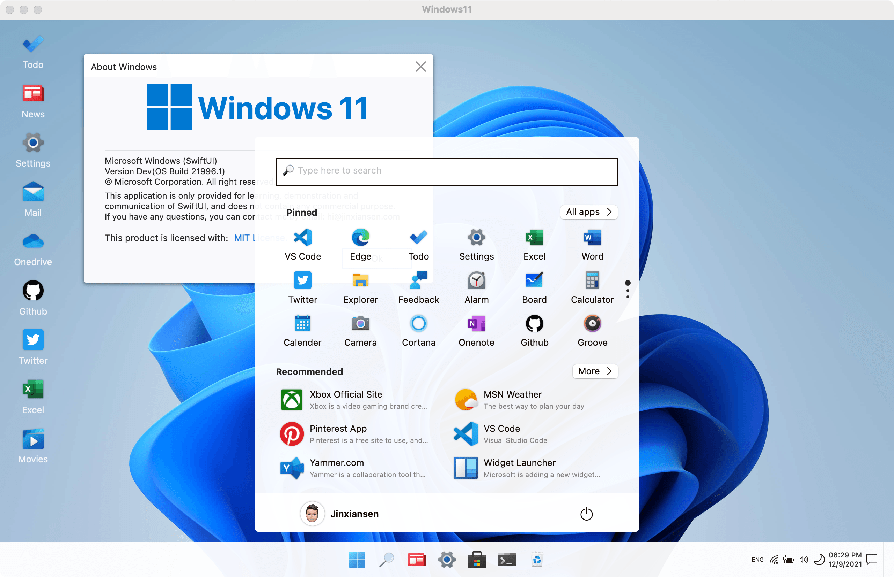
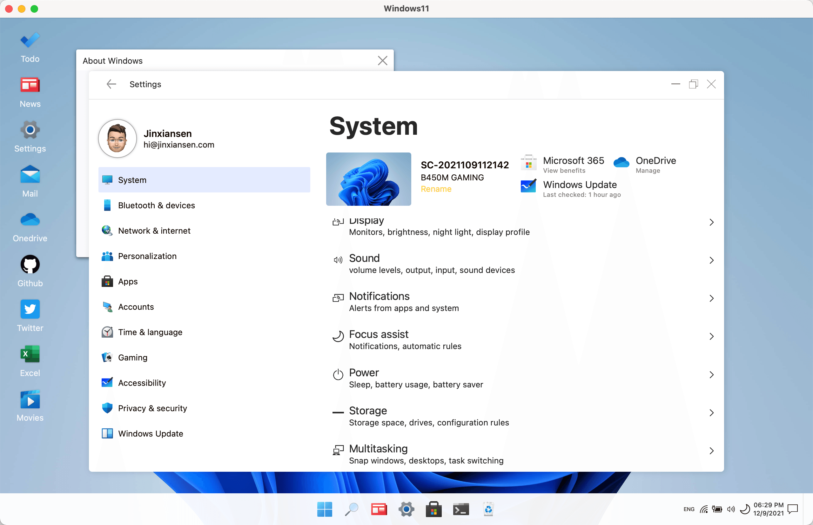
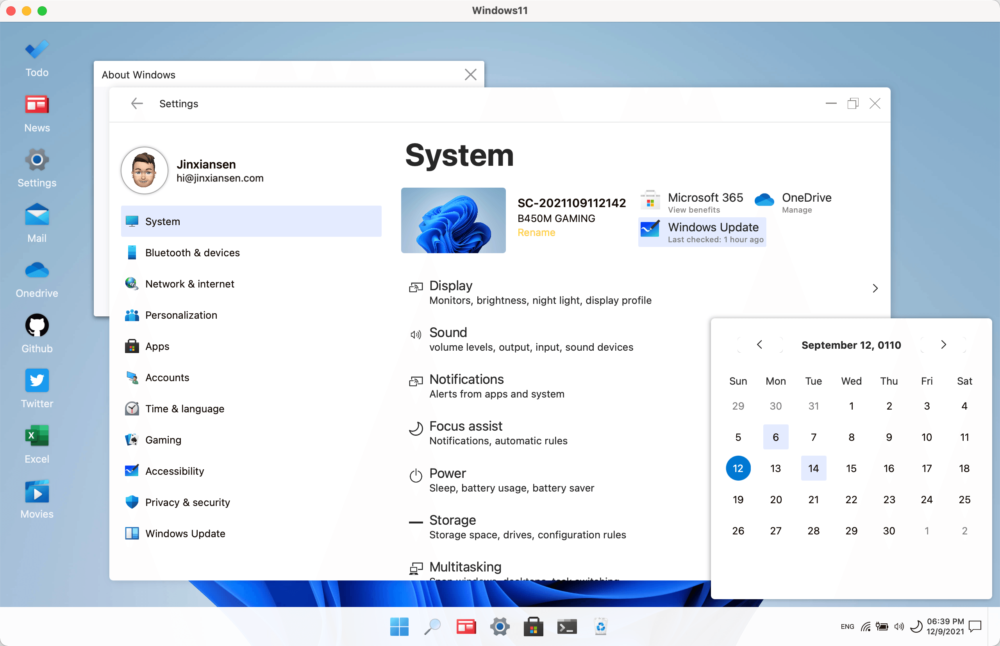

This is an open source project of the [Windows 11](https://www.microsoft.com/en-sg/windows/windows-11) desktop client implemented using [SwiftUI](https://developer.apple.com/xcode/swiftui/). I hope to restore the Windows 11 desktop experience to the greatest extent possible.

Since I did not have a Windows 11 computer, all interface styles and interactions were designed with reference to resources on the Internet. If there are errors or omissions, please feel free to correct me!

If you have a strong interest in SwiftUI, you can join the SwiftUI QQ Group: **18552966** to discuss communication.

If you are new to SwiftUI, maybe my other SwiftUI framework usage guide [[Jinxiansen/SwiftUI](https://github.com/Jinxiansen/SwiftUI) ] project can help you.

> English is not my native language; please excuse typing errors.

[中文版🇨🇳](README_CN.md)

# Requirements 

- macOS 11.0
- SwiftUI 2.0

# Screenshot

### Gif Preview: 

### ScreenShot:

# Features:

- [x] Launch, Lock, Login and Desktop screen.
- [x] Desktop apps and Right Click action
- [x] Notification and Calendar View
- [x] Launchpad and System View
- [x] Dark Mode
- [x] Hover View and Extension
- [x] Drag View and Extension
- [ ] File Explorer
- [ ] Other apps
- [ ] ...

# FAQ

- Why develop this project?
	-  Because when I first came into contact with the online world, I used Windows. From [Win95](https://microsoft.fandom.com/wiki/Windows_95) when I was in elementary school, 20 years have passed since then. Although I haven't used Windows for work reasons in recent years, I still maintain my enthusiasm for Windows. This time Microsoft has released Windows 11, which is so beautiful! So I spent some time writing this project, I hope it will be helpful for beginners of SwiftUI.

- How long did this project take?
	-  From development to open source, it took about 30 hours, mainly in some scattered time at night and weekends.

- About the maintenance plan after open source?
	-  After the project is open source, it will continue to be maintained, continue to increase and improve each Windows page and interaction details, and strive to approximate the real experience of Windows! I also welcome you to join and work hard together!

- What are the current problems of the project?
	- As part of the API of SwiftUI is not customizable, it is not completely consistent with Windows when implementing certain functions. I can only try some alternatives for the time being. If you have better suggestions, I look forward to letting me know!
	- Due to my limited technical level and insufficient understanding of SwiftUI, I may write some code that is not so concise. I hope you can correct me or submit a [PR](https://github.com/Jinxiansen/Windows11/pulls) to modify it! thank you very much!

> English is not my native language; please excuse typing errors.

## Statement

This app is only provided for learning, demonstration and communication of SwiftUI, and does not contain any commercial purpose.\nIf you have any questions, you can contact me by email.

Email: hi@jinxiansen.com

## License	

Windows11 is released under the [MIT license](LICENSE). See LICENSE for details.
