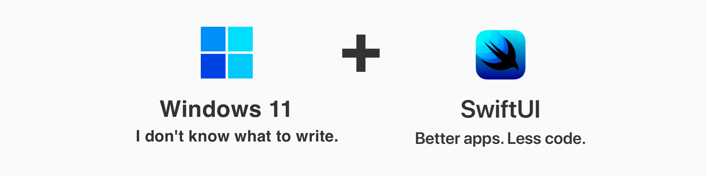
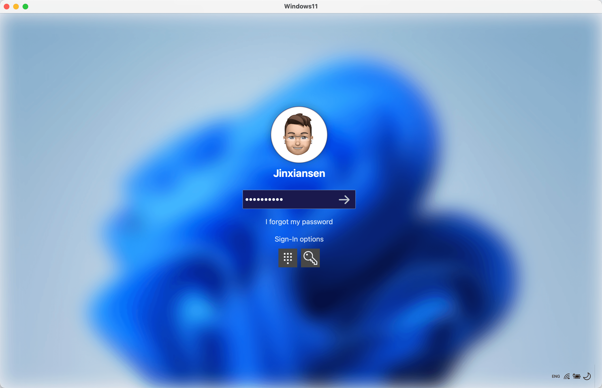

这是一个使用 [SwiftUI](https://developer.apple.com/xcode/swiftui/) 实现的 [Windows 11](https://www.microsoft.com/en-sg/windows/windows-11) 桌面客户端的开源项目，希望能够尽最大程度还原 Windows 11 的桌面使用体验。

由于我未能拥有 Windows 11 电脑，所以所有界面的样式和交互，都是参考网络上的资源进行设计的，如果有错误和疏漏之处，请不吝指正！

如果你对 `SwiftUI` 感到陌生，希望我另外一个项目：SwiftUI 使用指南 [[Jinxiansen/SwiftUI](https://github.com/Jinxiansen/SwiftUI) ] 可以帮助你。

如果你对 `SwiftUI` 有浓厚的兴趣，可加入 SwiftUI 线上 QQ 交流群：**18552966** ，共同学习交流。

[English Version📔](README.md)

# 预览

### Gif: 

### 截图:

# 功能:

- [x] 启动、锁屏、登录和桌面界面。
- [x] 桌面应用和右键功能。
- [x] 通知和日历。
- [x] 启动台和系统设置。
- [x] 黑暗模式。
- [x] 悬停视图状态及扩展。
- [x] 拖拽扩展。
- [ ] 文件浏览器。
- [ ] 其他 App ...
- [ ] ...

# 环境 

- SwiftUI 2.0
- macOS 11.0

# FAQ

- 为什么写这个项目？
	-  因为从我接触网络世界开始，使用的就是 Windows，从上小学时的 [Win95](https://microsoft.fandom.com/wiki/Windows_95) 到现在，虽然最近几年由于工作原因没有使用 Windows，但却仍然保持着对 Windows 的热情，这次微软发布的 Windows 11 让人眼前一亮，忍不住花了一些时间写了这个项目，希望对于 SwiftUI 的初学者能够有所帮助。

- 这个项目花了多久？
	-  从开发到开源，大概花了30多小时，主要是夜晚和周末的一些零散时间写的。

- 关于开源后的维护计划？
	- 开源之后依然会持续维护，持续增加及完善每个 Windows 的页面以及交互细节，力求逼近 Windows 的真实体验！也非常欢迎和期待你的加入，一起维护！

- 项目目前存在哪些问题？
	- 由于 SwiftUI 的一部分部分 API 不可定制，导致在实现某些功能的时候，并不能完全做到和 Windows 一致，我暂时只能尝试一些替代方案，如果你有更好的建议，期待告诉我！
	- 由于对 SwiftUI 框架的熟悉程度有限，可能会写出一些不那么好看的代码，希望能够指正我或提交 [PR](https://github.com/Jinxiansen/Windows11/pulls) 修改它！

## 声明

本应用仅涉及 SwiftUI 的学习及交流，不包含任何商业目的，如有任何问题，可以通过邮箱联系我.

邮箱: hi@jinxiansen.com

## 协议	

Windows11 基于 [MIT 许可](LICENSE) 协议发布。 更多详细信息，请参阅许可协议。
